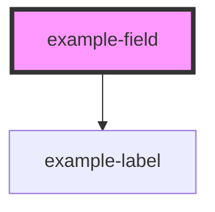

# example-field

<!-- Auto Generated Below -->

## Properties

| Property             | Attribute             | Description                                                                                                                                        | Type      | Default        |
| -------------------- | --------------------- | -------------------------------------------------------------------------------------------------------------------------------------------------- | --------- | -------------- |
| `disabledValidation` | `disabled-validation` | Setting to true will disable the validation on the field                                                                                           | `boolean` | `false`        |
| `error`              | `error`               | Error text for when using as a controlled component                                                                                                | `string`  | `''`           |
| `hiddenLabel`        | `hidden-label`        | Visually hides the label text, but still available to screenreaders                                                                                | `boolean` | `false`        |
| `hint`               | `hint`                | Text to be displayed as supporting field description                                                                                               | `string`  | `undefined`    |
| `inline`             | `inline`              | Displays multiple children in line rather than stacked.                                                                                            | `boolean` | `undefined`    |
| `inputGroup`         | `input-group`         | Renders a fieldset if set to true                                                                                                                  | `boolean` | `false`        |
| `join`               | `join`                | Removes margin from inline child components. Only activates when inline prop is also set.                                                          | `boolean` | `undefined`    |
| `label`              | `label`               | Text to be displayed in the label. This can form part of error messages to make sure it makes sense in this context                                | `string`  | `undefined`    |
| `optionalText`       | `optional-text`       | Text that is added to a label to mark a field as optional                                                                                          | `string`  | `'(optional)'` |
| `patternMismatch`    | `pattern-mismatch`    | Error message to be displayed when the characters does fulfil the pattern provided by the `pattern` prop. Defaults to HTML5 default message.       | `string`  | `undefined`    |
| `rangeOverflow`      | `range-overflow`      | Error message to be displayed when the number value exceed the `max` property. Defaults to HTML5 default message.                                  | `string`  | `undefined`    |
| `rangeUnderflow`     | `range-underflow`     | Error message to be displayed when the number value is lower than the `min` property. Defaults to HTML5 default message.                           | `string`  | `undefined`    |
| `stepMismatch`       | `step-mismatch`       | Error message to be displayed when the number of characters exceed the `maxlength` property. Defaults to HTML5 default message.                    | `string`  | `undefined`    |
| `tooLong`            | `too-long`            | Error message to be displayed when the number of characters exceed the `maxlength` property. Defaults to HTML5 default message.                    | `string`  | `undefined`    |
| `tooShort`           | `too-short`           | Error message to be displayed when there are not enough characters to equal or exceed the `minlength` property. Defaults to HTML5 default message. | `string`  | `undefined`    |
| `typeMismatch`       | `type-mismatch`       | Error message to be displayed when the field value is not the correct syntax. Defaults to HTML5 default message.                                   | `string`  | `undefined`    |
| `valueMissing`       | `value-missing`       | Error message to be displayed when the input is required and no value has been entered. Defaults to HTML5 default message.                         | `string`  | `undefined`    |

## Events

| Event                   | Description                      | Type               |
| ----------------------- | -------------------------------- | ------------------ |
| `exampleFieldDidLoad`   | Emitted when an input loads      | `CustomEvent<any>` |
| `exampleFieldDidUnload` | Emitted when an input is removed | `CustomEvent<any>` |

## Methods

### `registerInputElement(fieldData: InputEventStatus | FormFieldStatus) => Promise<void>`

Registers input elements within field

#### Returns

Type: `Promise<void>`

### `resetField() => Promise<void>`

Resets field to initial state

#### Returns

Type: `Promise<void>`

### `unregisterInputElement(fieldData: FormFieldStatus | InputEventStatus) => Promise<void>`

Unregisters input elements within field

#### Returns

Type: `Promise<void>`

### `validateField() => Promise<void>`

Validates the form elements

#### Returns

Type: `Promise<void>`

## Slots

| Slot | Description                                                                                 |
| ---- | ------------------------------------------------------------------------------------------- |
|      | Content is place after the label and any error messages. This should contain form controls. |

## CSS Custom Properties

| Name                                      | Description                                 |
| ----------------------------------------- | ------------------------------------------- |
| `--example-background-color`              | Background colour of the field              |
| `--example-background-color--focus`       | Background colour of the field when focused |
| `--example-border-color`                  | Border colour of field                      |
| `--example-border-color--focus`           | Border colour of field when focused         |
| `--example-border-left`                   | Left border of field                        |
| `--example-hint-color`                    | Colour of the hint text                     |
| `--example-input-spacing-x`               | Spacing between multiple inline inputs      |
| `--example-input-spacing-y`               | Spacing between multiple stacked inputs     |
| `--example-margin-x`                      | Horizontal margin for the field             |
| `--example-max-width`                     | Max width of the field                      |
| `--example-multiple-elements-label-color` | Colour of the multi element label           |
| `--example-transition`                    | Transition animation of the field           |

## Dependencies

### Depends on

- [example-label](../label)

### Graph

----------------------------------------------

*Built with [StencilJS](https://stenciljs.com/)*
