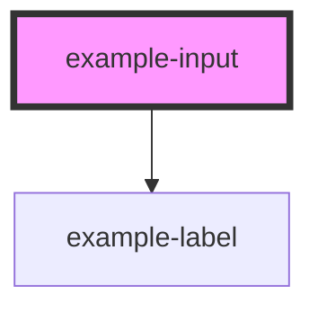

# example-input

<!-- Auto Generated Below -->

## Properties

| Property          | Attribute           | Description                                                                                                                                                                                                                                                                                                                                                                              | Type                                                                                                                                                                                                                                                                                                                                                                                                                                                                             | Default              |
| ----------------- | ------------------- | ---------------------------------------------------------------------------------------------------------------------------------------------------------------------------------------------------------------------------------------------------------------------------------------------------------------------------------------------------------------------------------------- | -------------------------------------------------------------------------------------------------------------------------------------------------------------------------------------------------------------------------------------------------------------------------------------------------------------------------------------------------------------------------------------------------------------------------------------------------------------------------------- | -------------------- |
| `autocomplete`    | `autocomplete`      | Indicates whether the value of the control can be automatically completed by the browser.                                                                                                                                                                                                                                                                                                | `string`                                                                                                                                                                                                                                                                                                                                                                                                                                                                         | `'off'`              |
| `autocorrect`     | `autocorrect`       | Whether auto correction should be enabled when the user is entering/editing the text value.                                                                                                                                                                                                                                                                                              | `"off" \| "on"`                                                                                                                                                                                                                                                                                                                                                                                                                                                                  | `'off'`              |
| `clearable`       | `clearable`         | If `true`, then user can clear the value of the input. Will be ignored if `rows` prop is in use.                                                                                                                                                                                                                                                                                         | `boolean`                                                                                                                                                                                                                                                                                                                                                                                                                                                                        | `false`              |
| `hiddenLabel`     | `hidden-label`      | Visually hides the label (if set), label will still be read out by screenreaders                                                                                                                                                                                                                                                                                                         | `boolean`                                                                                                                                                                                                                                                                                                                                                                                                                                                                        | `undefined`          |
| `inputmode`       | `inputmode`         | A hint to the browser for which keyboard to display. Possible values: `"none"`, `"text"`, `"tel"`, `"url"`, `"email"`, `"numeric"`, `"decimal"`, and `"search"`.                                                                                                                                                                                                                         | `InputMode.Decimal \| InputMode.Email \| InputMode.None \| InputMode.Numeric \| InputMode.Search \| InputMode.Tel \| InputMode.Text \| InputMode.Url`                                                                                                                                                                                                                                                                                                                            | `undefined`          |
| `isAutocomplete`  | `is-autocomplete`   | Sets a role of "combobox" on the HTML input. Only needed for autocomplete controls.                                                                                                                                                                                                                                                                                                      | `boolean`                                                                                                                                                                                                                                                                                                                                                                                                                                                                        | `undefined`          |
| `isExpanded`      | `is-expanded`       | Sets the aria-expanded attribute on the HTML input. Only needed for autocomplete controls, and should be dynamically set to true when search results are shown                                                                                                                                                                                                                           | `boolean`                                                                                                                                                                                                                                                                                                                                                                                                                                                                        | `false`              |
| `max`             | `max`               | The maximum value, which must not be less than its minimum (min attribute) value.                                                                                                                                                                                                                                                                                                        | `string`                                                                                                                                                                                                                                                                                                                                                                                                                                                                         | `undefined`          |
| `maxlength`       | `maxlength`         | If the value of the type attribute is `text`, `email`, `search`, `password`, `tel`, or `url`, this attribute specifies the maximum number of characters that the user can enter.                                                                                                                                                                                                         | `number`                                                                                                                                                                                                                                                                                                                                                                                                                                                                         | `undefined`          |
| `min`             | `min`               | The minimum value, which must not be greater than its maximum (max attribute) value.                                                                                                                                                                                                                                                                                                     | `string`                                                                                                                                                                                                                                                                                                                                                                                                                                                                         | `undefined`          |
| `minlength`       | `minlength`         | If the value of the type attribute is `text`, `email`, `search`, `password`, `tel`, or `url`, this attribute specifies the minimum number of characters that the user can enter.                                                                                                                                                                                                         | `number`                                                                                                                                                                                                                                                                                                                                                                                                                                                                         | `undefined`          |
| `multiInputLabel` | `multi-input-label` | Label text to be used when there are multiple inputs in one field                                                                                                                                                                                                                                                                                                                        | `string`                                                                                                                                                                                                                                                                                                                                                                                                                                                                         | `undefined`          |
| `name`            | `name`              | The name of the control, which is submitted with the form data.                                                                                                                                                                                                                                                                                                                          | `string`                                                                                                                                                                                                                                                                                                                                                                                                                                                                         | `this.inputId`       |
| `optional`        | `optional`          | If `true`, the (optional) text is shown in the label. Will be ignored if `required` is set to `true`                                                                                                                                                                                                                                                                                     | `boolean`                                                                                                                                                                                                                                                                                                                                                                                                                                                                        | `false`              |
| `pattern`         | `pattern`           | A regular expression that the value is checked against. The pattern must match the entire value, not just some subset. Use the `hint` attribute on the field component to give the user extra information about the pattern. This attribute applies when the value of the type attribute is `"text"`, `"search"`, `"tel"`, `"url"`, `"email"`, or `"password"`, otherwise it is ignored. | `string`                                                                                                                                                                                                                                                                                                                                                                                                                                                                         | `undefined`          |
| `placeholder`     | `placeholder`       | Instructional text that shows before the input has a value.                                                                                                                                                                                                                                                                                                                              | `string`                                                                                                                                                                                                                                                                                                                                                                                                                                                                         | `undefined`          |
| `readonly`        | `readonly`          | If `true`, the user cannot modify the value.                                                                                                                                                                                                                                                                                                                                             | `boolean`                                                                                                                                                                                                                                                                                                                                                                                                                                                                        | `false`              |
| `required`        | `required`          | If `true`, the user must fill in a value before submitting a form.                                                                                                                                                                                                                                                                                                                       | `boolean`                                                                                                                                                                                                                                                                                                                                                                                                                                                                        | `false`              |
| `rows`            | `rows`              | Number of rows in the textarea (when set the component renders a textarea element)                                                                                                                                                                                                                                                                                                       | `number`                                                                                                                                                                                                                                                                                                                                                                                                                                                                         | `0`                  |
| `step`            | `step`              | Works with the min and max attributes to limit the increments at which a value can be set. Possible values are: `"any"` or a positive floating point number.                                                                                                                                                                                                                             | `string`                                                                                                                                                                                                                                                                                                                                                                                                                                                                         | `undefined`          |
| `type`            | `type`              | The type of control to display. The default type is text.                                                                                                                                                                                                                                                                                                                                | `TextFieldType.Color \| TextFieldType.Date \| TextFieldType.Email \| TextFieldType.Number \| TextFieldType.Password \| TextFieldType.Search \| TextFieldType.Tel \| TextFieldType.Text \| TextFieldType.Time \| TextFieldType.Url`                                                                                                                                                                                                                                               | `TextFieldType.Text` |
| `value`           | `value`             | The value of the input.                                                                                                                                                                                                                                                                                                                                                                  | `string`                                                                                                                                                                                                                                                                                                                                                                                                                                                                         | `''`                 |
| `watermark`       | `watermark`         | When set to `true` add ons will render with a different style. Will be ignored if `prepend` or `append` slots are not being used.                                                                                                                                                                                                                                                        | `boolean`                                                                                                                                                                                                                                                                                                                                                                                                                                                                        | `false`              |
| `width`           | `width`             | The width of the input.                                                                                                                                                                                                                                                                                                                                                                  | `InputWidth.Eight \| InputWidth.FiftyPercent \| InputWidth.Four \| InputWidth.SeventyFivePercent \| InputWidth.Six \| InputWidth.Sixteen \| InputWidth.Ten \| InputWidth.Twelve \| InputWidth.TwentyFivePercent \| InputWidth.Two \| SelectWidth.Eight \| SelectWidth.FiftyPercent \| SelectWidth.Four \| SelectWidth.SeventyFivePercent \| SelectWidth.Six \| SelectWidth.Sixteen \| SelectWidth.Ten \| SelectWidth.Twelve \| SelectWidth.TwentyFivePercent \| SelectWidth.Two` | `undefined`          |

## Events

| Event                   | Description                                  | Type                                                   |
| ----------------------- | -------------------------------------------- | ------------------------------------------------------ |
| `exampleBlur`           | Emitted when the input loses focus.          | `CustomEvent<InputEventStatus>`                        |
| `exampleChange`         | Emitted when the value has changed.          | `CustomEvent<InputEventStatus>`                        |
| `exampleClear`          | Emitted when the input is manually cleared.  | `CustomEvent<InputEventStatus>`                        |
| `exampleErrorChange`    | Emitted when the inputs error state changes. | `CustomEvent<InputEventStatus>`                        |
| `exampleFocus`          | Emitted when the input has focus.            | `CustomEvent<InputEventStatus>`                        |
| `exampleInput`          | Emitted when a keyboard input occurred.      | `CustomEvent<KeyboardEvent>`                           |
| `exampleInputDidLoad`   | Emitted when an input loads                  | `CustomEvent<HTMLInputElement \| HTMLTextAreaElement>` |
| `exampleInputDidUnload` | Emitted when an input is removed             | `CustomEvent<HTMLInputElement \| HTMLTextAreaElement>` |
| `exampleKeyDown`        | Emitted when a keydown event occurs.         | `CustomEvent<KeyboardEvent>`                           |
| `exampleKeyUp`          | Emitted when a keyup event occurs.           | `CustomEvent<KeyboardEvent>`                           |

## Methods

### `getNativeElement() => Promise<NativeInputElement>`

Gets the input HTML element.

#### Returns

Type: `Promise<NativeInputElement>`

### `reset() => Promise<void>`

Resets the input to its original state.

#### Returns

Type: `Promise<void>`

### `validate() => Promise<void>`

Validates the input.

#### Returns

Type: `Promise<void>`

## Slots

| Slot        | Description                           |
| ----------- | ------------------------------------- |
| `"append"`  | Section after input to place add-ons  |
| `"prepend"` | Section before input to place add-ons |

## CSS Custom Properties

| Name                                | Description                                       |
| ----------------------------------- | ------------------------------------------------- |
| `--example-background-color`        | Background color of the input                     |
| `--example-background-color--focus` | Background color of the input when focussed       |
| `--example-border-color`            | Color of input border                             |
| `--example-border-color--focus`     | Color of input border when focussed               |
| `--example-border-radius`           | Border radius of input                            |
| `--example-border-size`             | Size of input border                              |
| `--example-color`                   | Text color of the input                           |
| `--example-font-size`               | Font size of the input                            |
| `--example-label-padding-bottom`    | Spacing between label and input                   |
| `--example-padding-x`               | Horizonal padding of the input                    |
| `--example-padding-y`               | Vertical padding of the input                     |
| `--example-placeholder-color`       | Text color of the input placeholder text          |
| `--example-transition`              | Transition animation for the input                |
| `--example-watermark-color`         | Text color of add ons when using `watermark` prop |

## Dependencies

### Depends on

- [example-label](../label)

### Graph

----------------------------------------------

*Built with [StencilJS](https://stenciljs.com/)*
