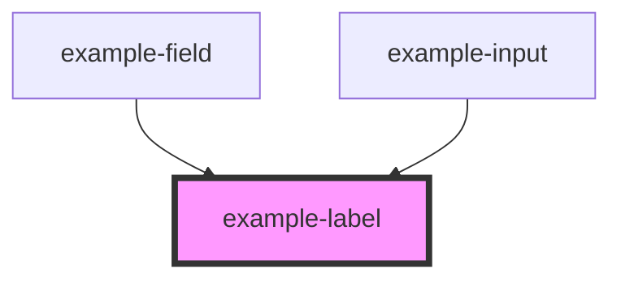

# example-label

<!-- Auto Generated Below -->

## Properties

| Property                 | Attribute       | Description                                                                                                          | Type      | Default        |
| ------------------------ | --------------- | -------------------------------------------------------------------------------------------------------------------- | --------- | -------------- |
| `focusOn`                | `focus-on`      | When true, element in the `for` will be focused on (for CheckboxGroup and RadioGroup)                                | `boolean` | `false`        |
| `for`                    | `for`           | Id of input that the label is labelling                                                                              | `string`  | `''`           |
| `hiddenLabel`            | `hidden-label`  | Visually hides the label text, but still available to screen readers                                                 | `boolean` | `false`        |
| `labelText` _(required)_ | `label-text`    | Text to be displayed in the label. This can form part of error messages to make sure it makes sense in this context  | `string`  | `undefined`    |
| `optional`               | `optional`      | When set to true, the text '(optional)' is displayed next to the label text. Will be ignored if `required` is `true` | `boolean` | `false`        |
| `optionalText`           | `optional-text` | Text that is read by a screen reader for a required field                                                            | `string`  | `'(optional)'` |
| `required`               | `required`      | When set to true, the 'required asterisk (*)' is displayed next to the label text                                    | `boolean` | `false`        |

## Slots

| Slot | Description                                             |
| ---- | ------------------------------------------------------- |
|      | Additional label content - Appears after the label text |

## CSS Custom Properties

| Name                              | Description                                                                                                    |
| --------------------------------- | -------------------------------------------------------------------------------------------------------------- |
| `--example-label-color`           | Colour of the Label text                                                                                       |
| `--example-label-font-size`       | Size of the label text                                                                                         |
| `--example-label-font-weight`     | Font weight of the label text                                                                                  |
| `--example-label-meta-font-size`  | Font size of the label meta data (required, optional) - should be in `em` so it is relative to label font size |
| `--example-label-meta-font-style` | Font style of the label meta data (required, optional)                                                         |
| `--example-label-optional-color`  | Colour of the optional indication text (optional)                                                              |
| `--example-label-required-color`  | Colour of the required indicator (*)                                                                           |

## Dependencies

### Used by

 - [example-field](../field)
 - [example-input](../input)

### Graph

----------------------------------------------

*Built with [StencilJS](https://stenciljs.com/)*
